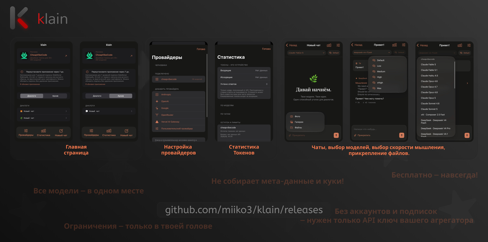

# klain



**Твои модели. Твои ключи. Один чат на iPhone.**

Нативный клиент на SwiftUI для общения с ИИ через собственные API-подключения. Для iPhone и iPad с **iOS 17+**.

[Скачать IPA](https://github.com/miiko3/klain/releases) · [Поддержать на Boosty](https://boosty.to/miilo3) · [Threads](https://www.threads.com/@klain_app) · [Telegram](https://t.me/yetilov)

## Возможности

- Несколько провайдеров: **Anthropic, OpenAI, Google, OpenRouter, Vercel AI Gateway** и пользовательские OpenAI-совместимые API.
- Загрузка списка моделей, добавление моделей вручную, свои HTTP-заголовки и Base URL.
- Локальная история, поиск, архив с восстановлением и удаление с подтверждением.
- Потоковые ответы, остановка генерации и разворачиваемые рассуждения, если API их передаёт.
- Уровни мышления: **Default, Low, Medium, High, xHigh, Max**. Поддержка зависит от модели и API.
- Markdown: заголовки, жирный текст, курсив, встроенный код и блоки кода с копированием.
- Вложения из файлов, галереи и камеры.
- Статистика токенов по чатам и моделям; стоимость, баланс и лимиты — при наличии данных API.
- Ключи, заголовки и черновики подключения в **Keychain**.
- Тёмный интерфейс и напоминание об обновлении 7-дневной подписи.

## Установка

1. Открой [Releases](https://github.com/miiko3/klain/releases) и скачай `klain-unsigned.ipa`.
2. Подпиши и установи IPA через **SideStore, AltStore или Sideloadly**.
3. При бесплатной 7-дневной подписи регулярно обновляй её через выбранный инструмент.

Таймер в klain — напоминание от первого запуска или ручного сброса, а не проверка срока сертификата. Кнопка «Я обновил приложение» сбрасывает только таймер и не продлевает подпись.

## Подключение API

1. Открой **Провайдеры** и выбери сервис или пользовательское подключение.
2. Введи Base URL и свой API-ключ. Для авторизации через заголовки ключ можно оставить пустым.
3. Нажми **Загрузить модели из API** или добавь ID модели вручную, затем сохрани подключение.
4. Создай чат и выбери модель в верхней строке.

Примеры Base URL:

| Сервис | Base URL |
| --- | --- |
| OpenAI | `https://api.openai.com/v1` |
| Anthropic | `https://api.anthropic.com/v1` |
| Google (OpenAI-совместимый API) | `https://generativelanguage.googleapis.com/v1beta/openai` |
| OpenRouter | `https://openrouter.ai/api/v1` |
| Vercel AI Gateway | `https://ai-gateway.vercel.sh/v1` |
| CheapVibeCode | `https://ru.cheapvibecode.ru/v1` |

Список моделей не гарантирует доступ по твоему тарифу. При ошибке уровня мышления попробуй **Default**. Незавершённые настройки доступны в разделе **Черновики**.

## Медиа и ограничения

Прикрепление фото, видео и документов требует поддержки выбранной моделью и провайдером. Лимиты клиента: **20 МБ на файл, 30 МБ на сообщение**.

klain отображает структурированные изображения и ссылки на видео, возвращаемые поддерживаемыми чат-API. Для моделей OpenRouter с заявленным выходом изображений запрашивается соответствующий режим. Это не универсальная генерация медиа: отдельные API генерации видео, аудио и нативные генераторы Google/xAI пока не реализованы. Для CheapVibeCode генерация медиа не подтверждена.

Статистика учитывает только полученные от API значения. Остаток rate limit — временный лимит, а не баланс купленных токенов. Баланс лимита ключа запрашивается для OpenRouter.

Передаётся история текущего чата, включая вложения; автоматического сокращения контекста пока нет. Во время генерации держи приложение открытым.

## Данные

История и вложения хранятся локально. Запросы отправляются выбранному API-провайдеру. Удаление чата стирает локальные сообщения, вложения и связанную статистику, но не удаляет данные на стороне провайдера.

## Сборка из исходников

На Mac с Xcode:

```sh
brew install xcodegen
xcodegen generate
open Klain.xcodeproj
```

Для установки из Xcode выбери свою Signing Team. Для сборки неподписанной IPA в GitHub открой **Actions → Build klain → Run workflow**. Готовый файл находится в артефакте `klain-unsigned`. API-ключи для сборки не нужны.

Проект в бета-версии. Сборки проверяются GitHub Actions; это не заменяет проверку функций на реальном устройстве и с конкретным API.

## Поддержать разработку

Если klain тебе полезен, поддержать разработку можно на **[Boosty — miilo3](https://boosty.to/miilo3)**.

Автор: **[miiko3](https://github.com/miiko3)** · [Threads @klain_app](https://www.threads.com/@klain_app) · [Telegram @yetilov](https://t.me/yetilov)

Ошибки и предложения: [GitHub Issues](https://github.com/miiko3/klain/issues). Не публикуй API-ключи в отчётах.
